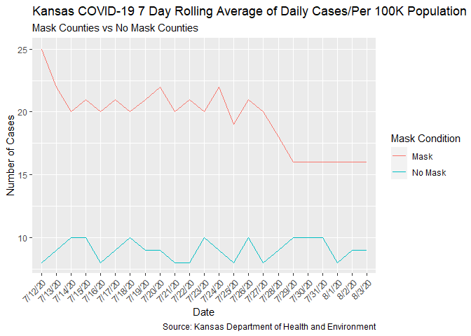

Lab 07 - Conveying the right message through visualisation
================
Fanyi Zeng
03/11/22

### Load packages and data

``` r
library(tidyverse) 
```

The following visualization was shared on Twitter as “extraordinary
misleading.”

<https://twitter.com/JonBoeckenstedt/status/1291602888376999936?ref_src=twsrc%5Etfw%7Ctwcamp%5Etweetembed%7Ctwterm%5E1291602888376999936&ref_url=https%3A%2F%2Fdatascience4psych.github.io%2FDataScience4Psych%2Flab07.html>

### Exercise 1

The most misleading part of the graph via the link above is that there
are two y axes for the mask and no-mask lines. This is wrong. Either the
two lines should be on the same y axis, or they should be on two
separate graphs. I will go with the first one, so that we can have a
better comparison.

To fix this, I will first create a data frame that can be used to
re-construct this visualization.

``` r
df <- tribble(
  ~date, ~mask, ~no_mask,
  "7/12/20",25,8,
  "7/13/20",22,9,
  "7/14/20",20,10,
  "7/15/20",21,10,
  "7/16/20",20,8,
  "7/17/20",21,9,
  "7/18/20",20,10,
  "7/19/20",21,9,
  "7/20/20",22,9,
  "7/21/20",20,8,
  "7/22/20",21,8,
  "7/23/20",20,10,
  "7/24/20",22,9,
  "7/25/20",19,8,
  "7/26/20",21,10,
  "7/27/20",20,8,
  "7/28/20",18,9,
  "7/29/20",16,10,
  "7/30/20",16,10,
  "7/31/20",16,10,
  "8/1/20",16,8,
  "8/2/20",16,9,
  "8/3/20",16,9,
)
```

### Exercise 2

Now, I will need to reshape the data to have one variable for mask
condition (mask vs. no-mask) and one variable for number of cases. In
other words, we will convert the data from wide format to long format.
You can see an excerpt of the new dataset below.

``` r
df_long <- df %>%
  pivot_longer(!date, names_to="mask_condition", values_to="cases") 
head(df_long)
```

    ## # A tibble: 6 x 3
    ##   date    mask_condition cases
    ##   <chr>   <chr>          <dbl>
    ## 1 7/12/20 mask              25
    ## 2 7/12/20 no_mask            8
    ## 3 7/13/20 mask              22
    ## 4 7/13/20 no_mask            9
    ## 5 7/14/20 mask              20
    ## 6 7/14/20 no_mask           10

### Exercise 3

Then, I will make a visualization that more accurately (and honestly)
tells the story.

``` r
df_long %>%
  ggplot(aes(x=date, y=cases, group=mask_condition, color=mask_condition)) +
  geom_line() +
  theme(axis.text.x = element_text(angle = 45, vjust=1, hjust=1)) +
  labs(title = "Kansas COVID-19 7 Day Rolling Average of Daily Cases/Per 100K Population" , subtitle = "Mask Counties vs No Mask Counties" , x = "Date" , y = "Number of Cases", color = "Mask Condition", caption = "Source: Kansas Department of Health and Environment") +
  scale_color_discrete(labels=c("Mask","No Mask"))
```

<!-- -->

It is clear that the two lines don’t overlap with each other. The
no-mask county has lower average number of cases than the masked county
at all times. However, it is still unclear what the unit of the number
of cases. For example, does cases = “25” mean 25 people out of 100k
people got sick? Or 25k people? We will have the ask the person who
collected the data. The unit will show how powerful mask-wearing is.

Just based on the graph itself, it seems not wearing a mask is not a big
deal in some regions, perhaps due to their low population density.
However, since we don’t know what the unit is, it could still be a lot
of people who got sick. Therefore, mask-wearing could have been very
helpful in the no-mask county.
